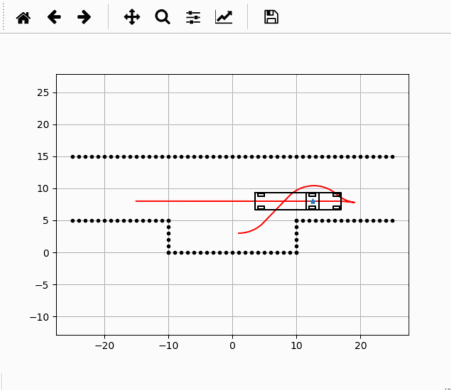
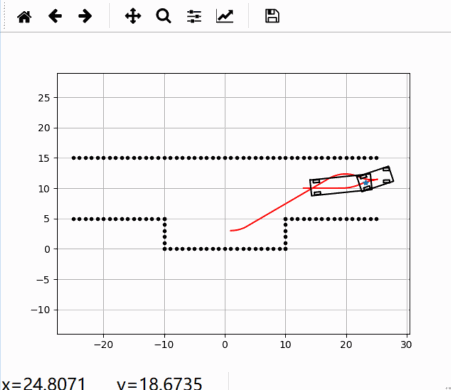
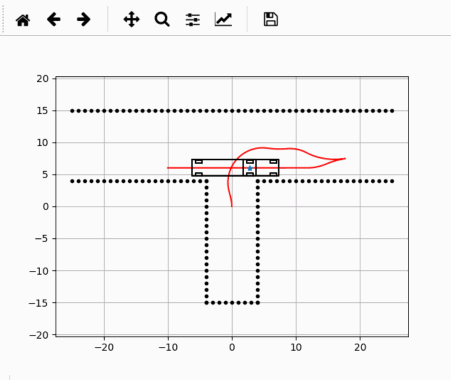
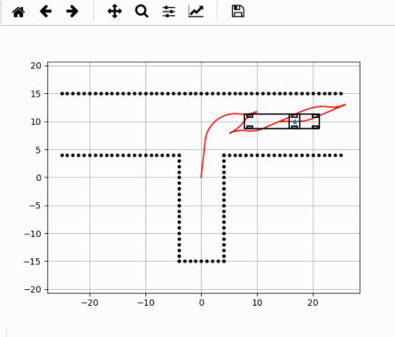

# Hybrid-AStar-Trailer-Mobile-Robot
Course Project of Wheeled Mobile Robots and Enhanced Lab Training of Zhejiang University.

## **Contents**
- [Introduction](#introduction)
- [Development Environment & Tools](#development-environment--tools)
- [Simulation Results](#simulation-results)
- [Experiments](#experiments)
- [Reference](#reference)

### **Introduction**
Implemented a path planning method for trailer trucks with non-holonomic dynamics based on Hybrid A* and
conducted experiments with DaNI robot.

### **Development Environment & Tools**
- Python 3.7
- DaNI Robot
- LabVIEW

### **Simulation Results**

### **Experiments**
Experiments on DaNI Robot and LabVIEW.

YouTube Link:

### **Reference**
[AtsushiSakai](https://github.com/AtsushiSakai)
